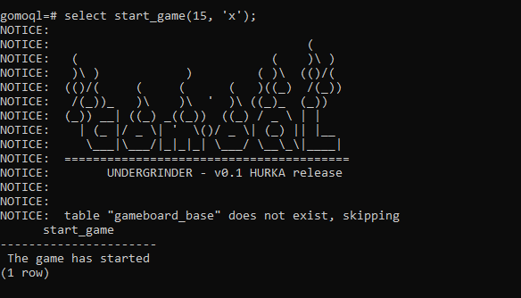
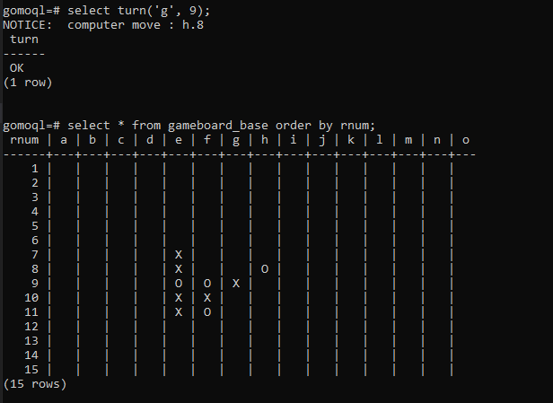
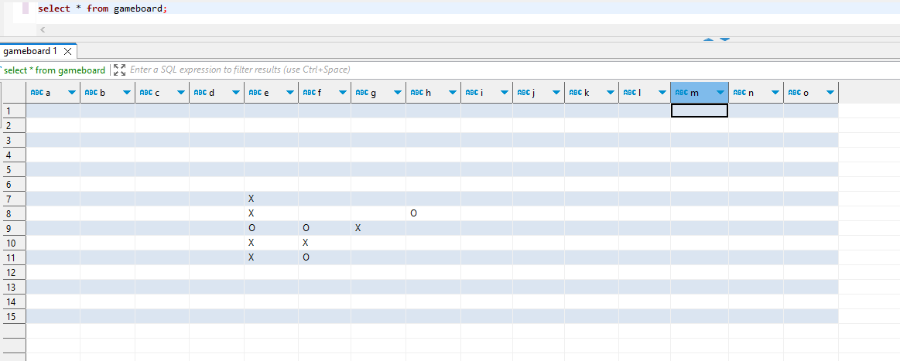
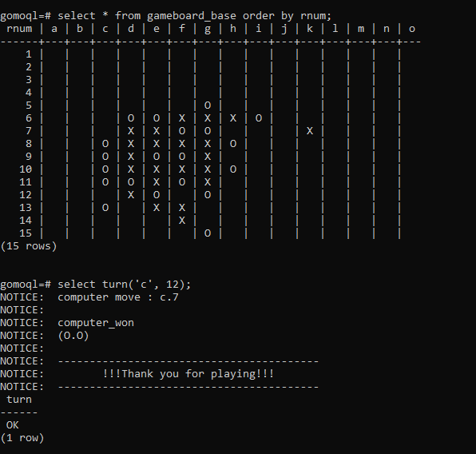

# GomoQL

This project is made for a friendly bet, it is just a proof of concept, that plpgsql is capable for such a thing as gomoku.
There were a strict deadline, the implementation is a mess, as well the code itself (the code is several years old), please don't judge me :D. 
The goal was create a game exclusively with sql/plpgsql with enjoyable gameplay, the invincibility of the computer player was not a goal. 
(The computer player is a bit simple, but the logic works though).

The repo needs a refactor, but I am not plan to do it, it is just a useless curiosity, and a memento of a great gameNight :) - I won the bet \m/

## Install
Tested on:
    | OS      | Version                                                                                                                     |
    |---------|-----------------------------------------------------------------------------------------------------------------------------|
    | Windows | PostgreSQL 13.2, compiled by Visual C++ build 1914, 64-bit                                                                  |
    | Linux   | PostgreSQL 15.2 (Debian 15.2-1.pgdg110+1) on x86_64-pc-linux-gnu, compiled by gcc (Debian 10.2.1-6) 10.2.1 20210110, 64-bit |

Run the DDL.sql first, then the other files in any order. The DDL contains a schema creation statement, you can create a separate database for the code if you would like to.

## Usage
The following commands assumes, that the gomoql schema is added to your seach path, so you don't need to add the schema name to the objects.
```sql
SET search_path TO gomoql;
```

### Start the game
```sql
-- SELECT gomoql.start_game(:an_size, :av_o_or_x);
-- an_size: size of the gameboard
-- av_o_or_x: symbol of the player (x/o)
select start_game(15, 'x');
```


### Turn of the player and check the gameboard
```sql
-- SELECT gomoql.turn(:av_col, :an_row);
-- av_col: column for the coordinate, char
-- an_row: row number for the coordinate, int
select turn('e', 10);

-- Check gameboard from command line:
select * from gameboard_base order by rnum;

-- Check gameboard from graphical client:
select * from gameboard;
```




